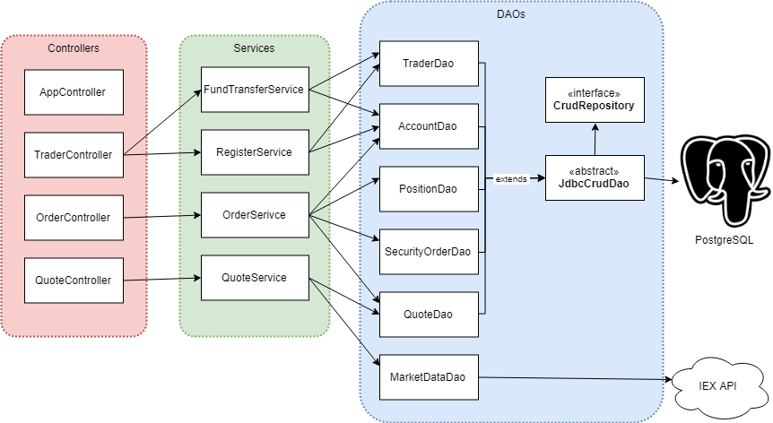

# Introduction
An online stock trading simlation REST API, built with a microservices architecture. Can be used to track accounts/positions/quotes and submit security orders. Could be connected to a front end stock trading website.
It's a MicroService implemented with SpringBoot. Uses a PSQL database, and accesses IEX market data through IEX API. Has Dockerfiles and scripts for setting up and deploying docker containers.

# Quick Start
 - Setup the proper environment variables. Edit `~/.bashrc` file to have them set up in every shell.
```$xslt
export IEX_PUB_TOKEN=<your-token>
export PSQL_USER=<your-psql-username>
export PSQL_PASSWORD=<your-password>
export PSQL_URL="jdbc:postgresql://jrvs-psql:5432/jrvstrading"
```
## With Docker
 - Prequiresites: Java, Docker, CentOS 7  
 - Start docker, navigate to the project folder, then run the docker setup script.
```$xslt
$ systemctl start docker
$ cd dll
$ bash setup_docker.sh
```
 - To interact with the app, open a web browser and connect to 
 `http://localhost:8080/swagger-ui.html#/`
## Without docker
 - Prequiresites: Java, CentOS 7, maven
 - Run a local psql server (you can go to the PostgreSQL website to see how).
 - Run the local jar script:
 ```$xslt
$ mvn clean package -DskipTests
$ bash run_local_jar.sh
```
- This runs the app in the background, so if you want to stop it, you can use this:
```$xslt
ps -u | awk '{ print $2,$13 }' | grep trading-1.0-SNAPSHOT.jar | awk '{print $1 }' | xargs -I {} kill {}
```
# REST API Usage
## Swagger
Swagger builds an interactive API documentation for this app. 
It allows for quick testing, and easy demonstrations.
## Quote Controller
Allows for creating, viewing, and updating market quotes. Quote data is gathered from the IEX
API which is an external market data source. Quotes are stored in a PostgreSQL database. 
  - `GET /quote/dailyList`: List all quotes that are stored/tracked in the database.
  - `GET /quote/getIexQuote/{ticker}`: Get the specified quote from IEX API.
  - `GET /quote/ticker/{ticker}`: Get the specified quote from the database.
  - `POST /quote/tickerId/{tickerId}`: Create a null quote with the given ticker.
  - `PUT /quote/`: Copy a quote from the request body to the database.
  - `PUT /quote/iexMarketData`: Update all quotes to match data from IEX API.
## Trader Controller
Allows for creating and managing trader accounts.
  - `DELETE /trader/delete`
  - `POST /trader/`: Create a trader using a TraderDto object in the request body.
  - `POST /trader/firstname/{firstname}/lastname/{lastname}/dob/{dob}/country/{country}/email/{email}`: Create a trader using the URL parameters.
  - `GET /trader/traderId/{traderId}`: View the account with the given trader id.
  - `PUT /trader/deposit/accountId/{accountId}/amount/{amount}`: Deposit the given amount into the given account.
  - `PUT /trader/withdraw/accountId/{accountId}/amount/{amount}`: Withdraw the given amount from the given account.
##Order Controller
Allows the creation of market orders.
  - `PUT /order/MarketOrder`: Tries to create a market order using the MarketOrderDto in the request body.
  Positive order sizes means buy, and negative means sell. Will cancel the order if the size is too large
  for the account balance, account position, or ask/bid size.
## App controller
- `GET /health` to make sure SpringBoot app is up and running
# Architecture

  - Controller: Handles Http requests by passing request parameters to the appropriate services,
   and returning any expected response body. Controllers divided by expected front end components.
  - Service: Conducts business logic with the request parameters. Calls DAOs for any necessary
 additional data, and to store any new data. Services divided by expected use cases.
  - Dao: Used to access databases and external APIs. Each table in the PSQL database has an
  associated DAO.
  - SpringBoot: Deploys the app automatically into embeded Tomcat instance. Uses Inversion of 
  Control to allow autowired components, runtime configuration, swagger, and other extremely
  useful features.
  - PSQL and IEX: The PSQL database stores Accounts, Traders, Positions, Quotes, and Security Orders.
  The quotes are initialized with 0-values until the app uses the IEX API to update them. 

# Improvements
- Auto update market data. Periodic update task while the app is running.
- User authentication (password table, security, https).
- Command-Line input for missing env variables, and database choices.
- User cancel market order.
- Quote data history (for data analysis).